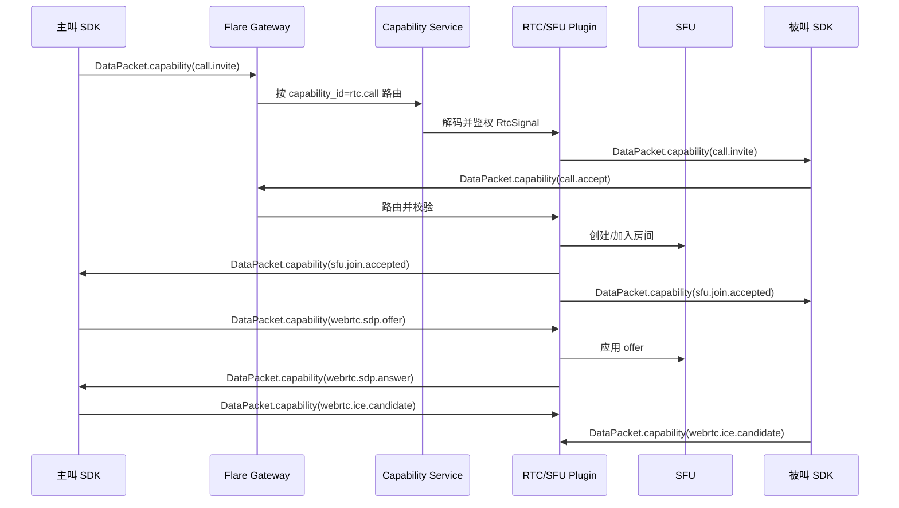

# WebRTC/SFU 信令如何通过 Flare Proto 传递

> 面向对象：Flare IM、Gateway、Capability、RTC/SFU Plugin、SDK 开发人员。
> 目标：说明 WebRTC/SFU 专属信令如何借助 `flare-proto` 传递，同时不让 `flare.common.v1` 依赖任何 RTC/SFU 专属协议。
> 状态：开发阶段目标设计，优先追求最简洁、最通用、最适合长期维护的实现。

## 结论先行

WebRTC/SFU 是一个可选能力，不是 IM Core 的通用领域模型。

因此：

- 不在 `flare.common.v1` 增加 `CallSignal`、`SfuSignal`、`RtcEvent`、SDP、ICE、SFU room 等专属类型。
- 不通过 `Event`、`Message`、`Sync`、`conversation_seq` 承载实时音视频协商信令。
- 统一通过 `DataPacket.capability` 传递非持久化能力包。
- `flare-proto` 只提供通用承载壳：`CapabilityPacket`。
- RTC/SFU 插件自己定义强类型 payload，例如 `flare.rtc.v1.RtcSignal`。

一句话：

```text
DataPacket.capability -> CapabilityPacket -> payload(bytes: flare.rtc.v1.RtcSignal)
```

## 边界原则

### `flare-proto` 负责什么

`flare-proto` 只负责通用 IM 协议壳：

- 能力路由：`capability_id`
- 能力动作：`packet_type`
- payload 版本：`version`
- 插件 payload 二进制：`payload`
- 非权威提示：`attributes`
- 调用关联：`correlation_id`

这些字段足够 Gateway、Capability Service、SDK 做通用分发。

### RTC/SFU 插件负责什么

RTC/SFU 插件负责所有专属语义：

- `call_id`
- `session_id`
- 参与人和设备
- 呼叫邀请、接听、拒绝、取消、结束
- SFU 房间创建、加入、离开
- SFU token
- SDP offer/answer
- ICE candidate
- track 发布/取消发布
- 静音、摄像头、屏幕共享状态
- 网络质量、媒体质量

这些都不进入 `flare.common.v1`。

## 为什么用 CapabilityPacket

现有 `proto/data.proto` 已经有通用能力包：

```proto
message CapabilityPacket {
  string capability_id = 1;  // e.g. rtc.call | bot.command | workflow.approval
  string packet_type = 2;    // plugin-owned action/type
  string version = 3;
  bytes payload = 4;         // plugin-owned protobuf/JSON bytes
  map<string, string> attributes = 5;
  optional string correlation_id = 6;
}
```

字段使用约定：

| 字段 | WebRTC/SFU 用法 |
| --- | --- |
| `capability_id` | 能力路由键。默认使用 `rtc.call`。只有当 SFU 作为独立能力开放时才考虑 `rtc.sfu`。 |
| `packet_type` | 插件动作名，例如 `call.invite`、`sfu.join.request`、`webrtc.sdp.offer`、`webrtc.ice.candidate`。 |
| `version` | payload schema 版本，例如 `rtc-sfu-signal.v1`。 |
| `payload` | RTC/SFU 插件自有 protobuf 序列化后的 bytes。开发早期可临时 JSON，但正式实现建议 protobuf。 |
| `attributes` | 非权威提示，例如 `topology=sfu`、`media=audio,video`。不能只靠它做鉴权或关键路由。 |
| `correlation_id` | 同一次呼叫/会话关联 id，通常就是 `call_id`。 |

`DataPacket.capability` 是非持久化实时控制包：

- 不写入消息历史。
- 不进入 Sync。
- 不占用 `conversation_seq`。
- 不参与消息可靠投递 ACK。
- 只在当前在线连接或插件会话内流转。

这正好适合 SDP、ICE、SFU join hint、track 状态、音视频状态、网络质量等实时信令。

## 推荐 capability_id

默认只使用一个能力：

```text
rtc.call
```

它覆盖完整呼叫生命周期和 WebRTC/SFU 协商。

只有在产品明确需要把 SFU 做成可独立使用的底层能力时，才增加：

```text
rtc.sfu
```

多数 IM 产品不需要拆成两个 public capability。推荐用 `rtc.call`，把细分语义放在 `packet_type` 和插件 payload 里。

## 推荐 packet_type

呼叫生命周期：

```text
call.invite
call.ring
call.accept
call.reject
call.cancel
call.end
```

SFU 会话：

```text
sfu.join.request
sfu.join.accepted
sfu.join.rejected
sfu.leave
```

WebRTC 协商：

```text
webrtc.sdp.offer
webrtc.sdp.answer
webrtc.ice.candidate
webrtc.ice.complete
```

媒体状态：

```text
media.track.published
media.track.unpublished
media.subscription.update
media.state.update
media.quality.report
```

命名规则：

- 用小写。
- 用点分层。
- 第一段是领域：`call`、`sfu`、`webrtc`、`media`。
- 不把版本写进 `packet_type`，版本放到 `version`。

## 插件自有 payload 设计

下面是建议给 RTC/SFU 插件单独定义的 proto。它不属于 `flare.common.v1`，可以放在 `flare-plugin`、`flare-sdk-plugin` 或独立 `flare-rtc-proto` 中。

```proto
syntax = "proto3";

package flare.rtc.v1;

message RtcSignal {
  string signal_id = 1;        // 本条信令的幂等 id。
  string call_id = 2;          // 一次呼叫的稳定 id。
  string session_id = 3;       // 单设备本次入会 session id。
  string conversation_id = 4;  // 如果呼叫属于某个 IM 会话，填会话 id。
  string from_user_id = 5;
  string from_device_id = 6;
  repeated RtcTarget targets = 7;
  int64 occurred_at = 8;       // Unix epoch milliseconds。

  oneof payload {
    CallInvite invite = 10;
    CallDecision decision = 11;
    CallEnd end = 12;

    SfuJoinRequest sfu_join_request = 20;
    SfuJoinAccepted sfu_join_accepted = 21;
    SfuJoinRejected sfu_join_rejected = 22;

    SdpOffer sdp_offer = 30;
    SdpAnswer sdp_answer = 31;
    IceCandidate ice_candidate = 32;
    IceComplete ice_complete = 33;

    MediaTrackEvent track = 40;
    MediaStateUpdate media_state = 41;
    MediaQualityReport quality = 42;
  }

  map<string, string> attributes = 100;
}

message RtcTarget {
  string user_id = 1;
  optional string device_id = 2;
  optional string session_id = 3;
}

message CallInvite {
  repeated string media_types = 1;       // audio, video, screen
  string topology = 2;                   // sfu
  optional int64 expire_at = 3;          // Unix epoch milliseconds。
  string display_title = 4;
}

message CallDecision {
  string decision = 1;                   // accept, reject, busy
  string reason = 2;
}

message CallEnd {
  string reason = 1;                     // ended, canceled, timeout, failed
  optional int64 duration_seconds = 2;
}

message SfuJoinRequest {
  string room_id = 1;
  repeated string publish_media_types = 2;
  repeated string subscribe_user_ids = 3;
}

message SfuJoinAccepted {
  string room_id = 1;
  string participant_id = 2;
  string endpoint = 3;
  string auth_token = 4;                 // 短期 SFU token。
  int64 token_expire_at = 5;             // Unix epoch milliseconds。
}

message SfuJoinRejected {
  int32 code = 1;
  string reason = 2;
}

message SdpOffer {
  string sdp = 1;
  string endpoint_role = 2;              // client_to_sfu, sfu_to_client
}

message SdpAnswer {
  string sdp = 1;
  string endpoint_role = 2;
}

message IceCandidate {
  string candidate = 1;
  string sdp_mid = 2;
  int32 sdp_mline_index = 3;
}

message IceComplete {
  string generation = 1;
}

message MediaTrackEvent {
  string action = 1;                     // published, unpublished, muted, unmuted
  string track_id = 2;
  string media_type = 3;                 // audio, video, screen
}

message MediaStateUpdate {
  bool audio_muted = 1;
  bool video_muted = 2;
  bool screen_sharing = 3;
}

message MediaQualityReport {
  int64 rtt_ms = 1;
  double packet_loss_rate = 2;
  int32 bitrate_kbps = 3;
}
```

设计要点：

- `signal_id` 用于幂等和去重。
- `call_id` 用于整通电话关联。
- `session_id` 区分同一用户的多个设备或重连会话。
- `targets` 由插件解析和扩展，Gateway 不理解它。
- `oneof payload` 是唯一类型判别，不再额外放 `type/kind` 字段。
- `attributes` 只是扩展槽，稳定语义必须放 typed fields。

## 编码方式

客户端或 RTC SDK 插件把 `RtcSignal` 编码进 `CapabilityPacket.payload`。

```rust
use prost::Message as _;

use flare_proto::common::data_packet::Payload as DataPayload;
use flare_proto::common::{CapabilityPacket, DataPacket};

fn encode_rtc_signal(
    call_id: String,
    packet_type: String,
    rtc_signal: flare_rtc_proto::RtcSignal,
) -> DataPacket {
    DataPacket {
        payload: Some(DataPayload::Capability(CapabilityPacket {
            capability_id: "rtc.call".to_string(),
            packet_type,
            version: "rtc-sfu-signal.v1".to_string(),
            payload: rtc_signal.encode_to_vec(),
            attributes: [
                ("topology".to_string(), "sfu".to_string()),
                ("schema".to_string(), "flare.rtc.v1.RtcSignal".to_string()),
            ]
            .into_iter()
            .collect(),
            correlation_id: Some(call_id),
        })),
    }
}
```

接收侧处理顺序：

1. SDK 收到 `DataPacket`。
2. 判断 `payload` 是否为 `DataPacket.capability`。
3. 根据 `capability_id = "rtc.call"` 分发给 RTC 插件。
4. RTC 插件检查 `version`。
5. RTC 插件按 `packet_type` 和 `payload` 解码 `RtcSignal`。
6. RTC 插件触发产品层回调或 WebRTC/SFU 操作。

## 端到端流程



## Gateway 路由规则

Gateway 不理解 SDP、ICE、SFU room，也不应该解析 RTC 专属 payload。

Gateway 只做通用职责：

1. 从连接上下文或传输 metadata 得到 tenant、user、device、trace、request 信息。
2. 识别 `DataPacket.capability`。
3. 按 `capability_id` 路由到 Capability Service。
4. 执行通用限流、payload 大小限制、连接背压、版本 allowlist。
5. 不把 `payload` 写入消息历史。
6. 不给该包分配 `conversation_seq`。

RTC/SFU 插件做专属职责：

1. 解码 `CapabilityPacket.payload`。
2. 校验 `version` 和 `packet_type`。
3. 校验租户、用户、设备、会话成员、能力开关。
4. 生成或校验 `call_id`、`session_id`、`signal_id`。
5. 创建/加入/离开 SFU 房间。
6. 生成短期 SFU token。
7. 转发 SDP/ICE。
8. 向目标设备下发新的 `DataPacket.capability`。
9. 对关键控制信令返回插件级 ACK/NACK。

## 可靠性模型

不同 RTC 信令的可靠性要求不同，不要一刀切。

| 信令 | 语义 | 建议处理 |
| --- | --- | --- |
| `call.invite`、`call.accept`、`call.reject`、`call.end` | 用户可感知控制流 | 插件级 ACK/NACK，按 `signal_id` 幂等去重，短 TTL 重试。 |
| `sfu.join.request`、`sfu.join.accepted` | 入会关键路径 | 必须收到插件结果后再开始 publish media。 |
| `webrtc.sdp.offer`、`webrtc.sdp.answer` | 协商关键路径 | 当前控制连接内可靠投递；重连后如果 session 仍有效，可按 `signal_id` 重试或重新协商。 |
| `webrtc.ice.candidate` | 高频协商提示 | 可批量、可限流，按 candidate generation 去重。 |
| `media.state.update` | 实时状态 | 按 participant/device LWW。 |
| `media.quality.report` | 监控遥测 | best-effort，压力大时可采样或丢弃。 |

不要使用：

- `SendAck` 确认 RTC 信令。
- `EventAck` 确认 RTC 信令。
- `conversation_seq` 排序 RTC 信令。
- `Sync` 恢复 SDP/ICE。

关键 RTC 信令需要确认时，由插件定义 ACK payload，再通过同一个 `correlation_id` 返回新的 `CapabilityPacket`。

## 哪些内容需要进入消息历史

实时 SFU 信令不进入 IM 历史，但用户可见的呼叫结果可以进入历史。

| 需求 | 推荐做法 |
| --- | --- |
| 在线弹出 incoming call | 下发 `DataPacket.capability(call.invite)`。 |
| 离线唤醒设备 | 走 Push/Notification，短 TTL；设备上线后向 RTC 插件拉取最新 call state。 |
| 会话里显示未接电话 | 发送普通 `Message`，使用 `CustomContent.type = "rtc.call_summary"` 或 `SystemContent`。 |
| 会话里显示通话时长 | 发送普通 `Message` 或更新插件自己的 call summary。 |
| 审计完整呼叫生命周期 | 插件自有 call store；只有 IM 读模型确实需要观察时才发 `CustomEvent`。 |
| 重连恢复旧 SDP/ICE | 不恢复旧包，重新协商。 |

## 包示例

### 呼叫邀请

```text
DataPacket.capability:
  capability_id: "rtc.call"
  packet_type: "call.invite"
  version: "rtc-sfu-signal.v1"
  correlation_id: "<call_id>"
  payload: RtcSignal {
    signal_id: "<signal_id>"
    call_id: "<call_id>"
    session_id: "<caller_device_session>"
    conversation_id: "<conversation_id>"
    payload: invite {
      media_types: ["audio", "video"]
      topology: "sfu"
      expire_at: 1779999001000
    }
  }
```

### 请求加入 SFU

```text
DataPacket.capability:
  capability_id: "rtc.call"
  packet_type: "sfu.join.request"
  version: "rtc-sfu-signal.v1"
  correlation_id: "<call_id>"
  payload: RtcSignal {
    signal_id: "<signal_id>"
    call_id: "<call_id>"
    session_id: "<device_session>"
    payload: sfu_join_request {
      room_id: "<room_id>"
      publish_media_types: ["audio", "video"]
    }
  }
```

### SDP Offer

```text
DataPacket.capability:
  capability_id: "rtc.call"
  packet_type: "webrtc.sdp.offer"
  version: "rtc-sfu-signal.v1"
  correlation_id: "<call_id>"
  payload: RtcSignal {
    signal_id: "<signal_id>"
    call_id: "<call_id>"
    session_id: "<device_session>"
    payload: sdp_offer {
      endpoint_role: "client_to_sfu"
      sdp: "<sdp>"
    }
  }
```

### ICE Candidate

```text
DataPacket.capability:
  capability_id: "rtc.call"
  packet_type: "webrtc.ice.candidate"
  version: "rtc-sfu-signal.v1"
  correlation_id: "<call_id>"
  payload: RtcSignal {
    signal_id: "<signal_id>"
    call_id: "<call_id>"
    session_id: "<device_session>"
    payload: ice_candidate {
      candidate: "<candidate>"
      sdp_mid: "0"
      sdp_mline_index: 0
    }
  }
```

## 安全要求

必须做到：

- 只信任连接上下文中的 tenant、user、device，不直接信任 payload 里的 `from_user_id`、`from_device_id`、`conversation_id`。
- 转发前校验会话成员关系。
- 转发前校验租户是否开启 `rtc.call` 能力。
- 转发前校验用户和设备是否有权限加入当前 call。
- SFU token 必须短期有效。
- SFU token 必须限定 tenant、room、participant、media direction。
- 默认日志不能打印 SDP、ICE candidate、SFU token。
- 对 ICE candidate 做限流，避免中继滥用。
- 拒绝不在能力发现结果里的 `version`。
- 媒体面安全由 WebRTC/DTLS/SRTP/SFU 负责；IM common 只承载信令 bytes。

## 运维要求

建议实现：

- `CapabilityPacket.payload` 最大长度限制。
- 每连接、每 call 的 bounded queue。
- ICE candidate 批量发送。
- 高压时丢弃过期 `media.quality.report`。
- 高压时合并 `media.state.update`。
- 所有关键包打 trace：tenant、user、device、`correlation_id`、`signal_id`、`packet_type`。
- 指标包括 invite 延迟、join 延迟、SDP 交换延迟、ICE 数量、重连重新协商次数、SFU join 失败数。

## SDK 形态

产品侧不应该直接手写 `CapabilityPacket`。SDK 插件应暴露强类型接口。

```rust
trait RtcCallPlugin {
    async fn invite(&self, conversation_id: String, media: Vec<String>) -> Result<String>;
    async fn accept(&self, call_id: String) -> Result<()>;
    async fn reject(&self, call_id: String, reason: String) -> Result<()>;
    async fn join_sfu(&self, call_id: String) -> Result<SfuJoinInfo>;
    async fn send_sdp_offer(&self, call_id: String, sdp: String) -> Result<()>;
    async fn send_sdp_answer(&self, call_id: String, sdp: String) -> Result<()>;
    async fn send_ice_candidate(&self, call_id: String, candidate: IceCandidate) -> Result<()>;
    async fn update_media_state(&self, call_id: String, state: MediaState) -> Result<()>;
    async fn end(&self, call_id: String, reason: String) -> Result<()>;
}
```

SDK 插件内部做：

1. 生成 `signal_id`。
2. 组装 `RtcSignal`。
3. protobuf 编码。
4. 组装 `CapabilityPacket`。
5. 通过 IM SDK 的 data/capability 通道发送。
6. 收到下行 `CapabilityPacket` 后解码并回调产品层。

## 反模式

不要这样做：

- 重新把 `call_signal.proto` 加回 `flare.common.v1`。
- 在 common `EventType` 里增加 `EVENT_CALL_INVITE`、`EVENT_SFU_JOIN`、`EVENT_ICE`。
- 把 SDP/ICE 放进 `Message.content`。
- 把 SDP/ICE 放进 `Event.custom` 后通过 Sync 恢复。
- 用 `conversation_seq` 排序实时音视频信令。
- 把稳定 RTC 字段塞进 `attributes` 字符串约定。
- 只根据 `CapabilityPacket.attributes` 做鉴权。
- 在 Gateway 里解析 SDP/ICE/SFU token。
- 用消息 ACK 语义确认 RTC 信令。

## 推荐落地顺序

1. `flare-proto` 保持现有 common 设计，继续使用 `DataPacket.capability`。
2. 在 RTC/SFU 插件仓库新增 `flare.rtc.v1` proto。
3. 在 SDK 插件中实现 `RtcSignal <-> CapabilityPacket` 编解码。
4. Gateway 增加按 `capability_id` 路由 capability packet。
5. Capability Service 增加能力开关、授权、目标解析、插件分发。
6. RTC/SFU Plugin 实现 invite、accept、join、SDP、ICE、track、media state、quality report。
7. Push/Notification 只负责离线唤醒，不承载完整 SDP/ICE。
8. 呼叫结束后如需展示历史，走普通消息流水线生成 call summary。
9. 增加契约测试，确保 `flare.common.v1` 不 import RTC/SFU proto。

## 开发检查清单

- `flare.common.v1` 没有新增 RTC/SFU 专属 message 或 enum。
- `event.proto` 没有 import RTC/SFU proto。
- 实时信令只通过 `DataPacket.capability`。
- `capability_id` 使用 `rtc.call`。
- `packet_type` 使用点分动作名。
- `payload` 使用插件自有 protobuf bytes。
- `correlation_id` 使用 `call_id`。
- 关键包有 `signal_id` 幂等键。
- Gateway 不解析 SDP/ICE。
- 插件做权限校验和 SFU token 生成。
- SDP/ICE 不进入 Sync。
- 呼叫历史只用普通 `Message` 或插件 call store 表达。

